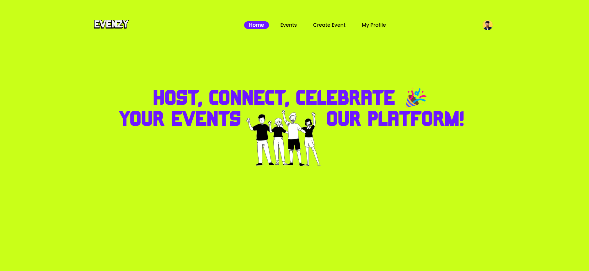
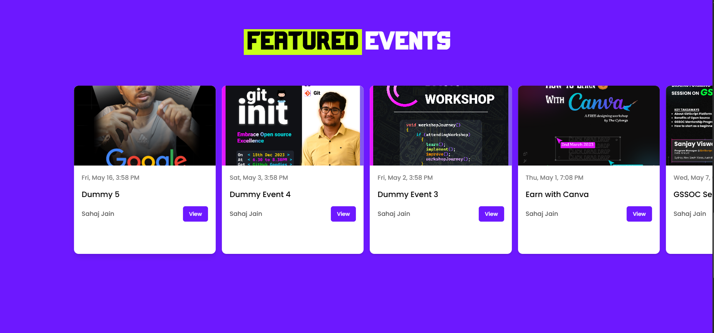
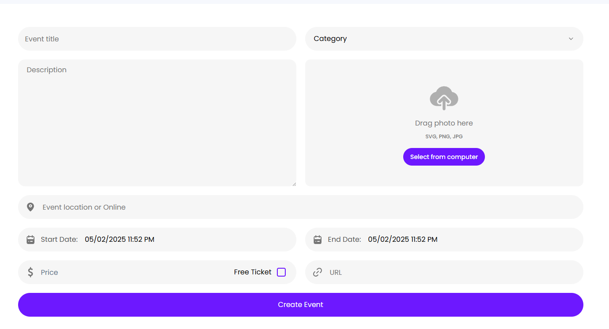

<div align="center">
  <br />
      
  <br />

  <div>
    
    
    
    
  </div>
</div>

# Evenzy

Built on `Next.js 14`, `EVENZY` is a full-stack platform for managing EVENTS. It serves as a hub, spotlighting diverse events taking place globally. Featuring seamless payment processing through `Stripe`, you have the capability to purchase tickets for any event or even initiate and manage your own events.


## 📸 Screenshots






## ✨ Features

- Authentication (CRUD) with Clerk
- Events (CRUD)
- Search & Filter
- New Category
- Checkout and Pay with Stripe
- Create a FREE or PAID Event
- View your organized events
- View your purchased tickets
- View related Events


## 🌐 Demo

https://evenzy.vercel.app


## 👾 Tech Stack

- Node.js
- Next.js
- MongoDB
- Clerk
- TypeScript
- TailwindCSS
- Stripe
- Zod
- React Hook Form
- Shadcn
- uploadthing

## 💻 Run Locally

Clone the project

```bash
  git clone https://github.com/ThisIsSahaj/Evenzy.git
```

Go to the project directory

```bash
  cd Evenzy
```

Install dependencies

```bash
  npm install
```

Start the server

```bash
  npm run dev
```
Open http://localhost:3000 in your browser to view the project.


## ⚙️ Environment Variables

To run this project, you will need to add the following environment variables to your `.env` file

```
#NEXT
NEXT_PUBLIC_SERVER_URL=

#CLERK
NEXT_PUBLIC_CLERK_PUBLISHABLE_KEY=
CLERK_SECRET_KEY=
NEXT_CLERK_WEBHOOK_SECRET=

NEXT_PUBLIC_CLERK_SIGN_IN_URL=/sign-in
NEXT_PUBLIC_CLERK_SIGN_UP_URL=/sign-up
NEXT_PUBLIC_CLERK_AFTER_SIGN_IN_URL=/
NEXT_PUBLIC_CLERK_AFTER_SIGN_UP_URL=/

#MONGODB
MONGODB_URI=

#UPLOADTHING
UPLOADTHING_SECRET=
UPLOADTHING_APP_ID=

#STRIPE
STRIPE_SECRET_KEY=
STRIPE_WEBHOOK_SECRET=
NEXT_PUBLIC_STRIPE_PUBLISHABLE_KEY=
```


## 🧑‍💻 Author

- [@thisissahaj](https://www.github.com/ThisIsSahaj)

